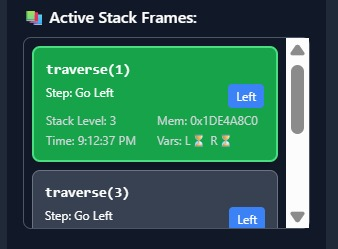
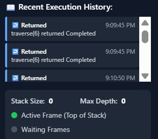
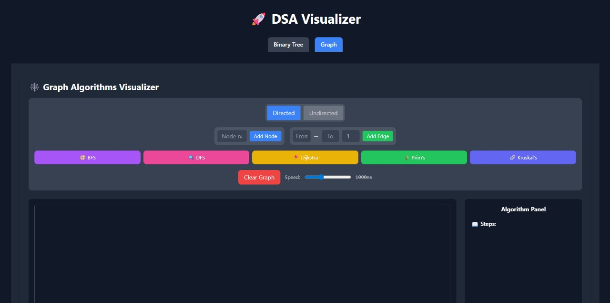
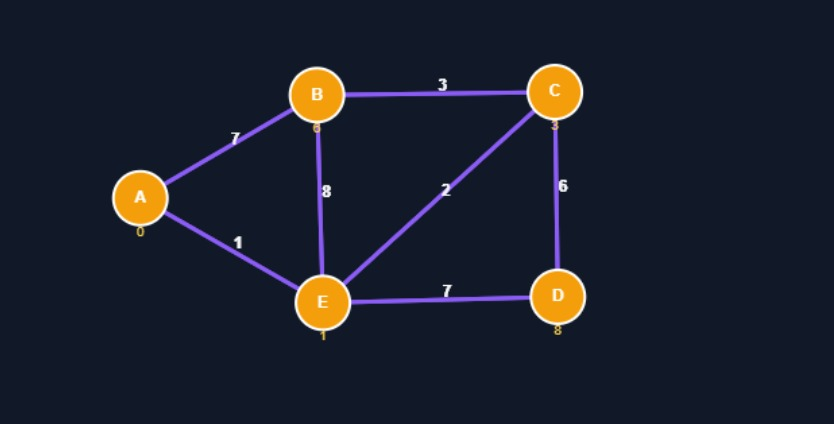
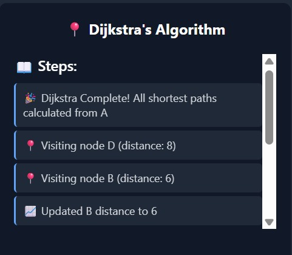

# DSA_Visualizer

An interactive Data Structures & Algorithms Visualizer built to help students understand how algorithms work through step-by-step visual animations.
<br>

## Features

- Step-by-step algorithm visualization
- Clear representation of comparisons & swaps
- Smooth animations for better understanding
- Beginner-friendly learning tool
- Clean UI and modular JavaScript logic

## Algorithms Visualized
- Trees
- Graphs

## Tech Stack
- Frontend: React.js + Tailwind CSS
- Styling: Tailwind CSS (PostCSS)
- Tooling: Node.js, npm

## Project Structure

```
DSA_Visualizer/
│
├── frontend/
│   │
│   ├── node_modules/              # Installed dependencies
│   │
│   ├── public/                    # Static assets
│   │   ├── favicon.ico
│   │   ├── index.html
│   │   ├── logo192.png
│   │   ├── logo512.png
│   │   ├── manifest.json
│   │   └── robots.txt
│   │
│   ├── src/                       # React application source
│   │   ├── components/            # Reusable UI components
│   │   │   ├── BinaryTree.js      # Binary Tree visualization
│   │   │   └── GraphVisualizer.js # Graph visualization
│   │   │
│   │   ├── App.css
│   │   ├── App.js
│   │   ├── index.css
│   │   └── index.js
│   │
│   │---├── .gitignore
│   │   ├── package.json           # Project metadata & scripts
│   │   ├── package-lock.json      # Dependency lock file
│   │   ├── postcss.config.js      # PostCSS configuration
│   │   ├── tailwind.config.js     # Tailwind CSS configuration
│   │   └── README.md              # Frontend README
│
├── README.md                      # Root project README

```

## 📦 Requirements & Dependencies

To run this project locally, ensure the following tools are installed on your system.

### 🔹 System Requirements
- **Node.js** (v16 or higher recommended)
- **npm** (comes with Node.js)
- A modern web browser (Chrome / Edge / Firefox)

Check installed versions:
```bash
node -v
npm -v
```


## Dependencies Used

All dependencies are defined in the package.json file and will be installed automatically.

- Core Dependencies

  ->react – Frontend UI library<br>
  ->react-dom – DOM rendering for React<br>
  ->react-scripts – Development & build scripts (Create React App)<br>

- Styling Dependencies

  ->tailwindcss – Utility-first CSS framework<br>
  ->postcss – CSS processing tool<br>
  ->autoprefixer – Adds vendor prefixes for browser compatibility<br>

## Installation & Setup
Follow the steps below to run the project locally.
### 1. Clone the repository
``` bash
git clone https://github.com/Dhrub-Kumar-Garg/DSA_Visualizer.git
```
### 2. Navigate to the frontend folder
```
cd DSA_Visualizer/frontend
```
### 3. Install dependencies
```
npm install
```
### 4. Start the development server
```
npm start
```
npm start
```
http://localhost:3000
```

##  Screenshots

###  - Binary Tree Visualizer
<br>
## 🌳 Binary Tree Dashboard

**Full Binary Tree View**


**Tree After Node Insertion**


**Stack Representation**



**Result Output**


**Operation History**




---

###  Graph Visualizer
**Dashboard Overview**



**Graph Added Successfully**


**Result Output**




**Operation History**




